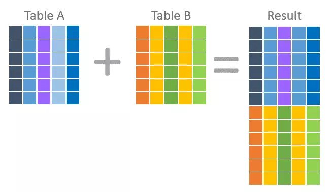

# 13. 집합 연산자

- Set Operator vs Join




```sql
SELECT *
FROM hr.employees
WHERE ((department_id = 30 AND salary > 3000) OR (department_id = 100 AND salary > 10000));
```

```sql
SELECT * FROM hr.employees WHERE department_id = 30 AND salary > 3000
UNION ALL
SELECT * FROM hr.employees WHERE department_id = 100 AND salary > 10000;
```
