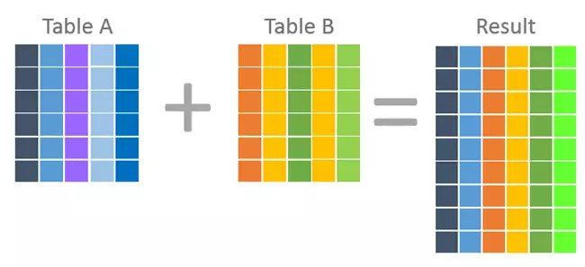
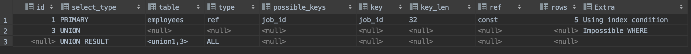

# 13. 집합 연산자

- Set Operator vs Join





## 주의 사항

Union 을 하고자 하는 테이블은 서로 형식이 같아야 합니다.


## 활용 예제

https://stackoverflow.com/questions/13750475/sql-performance-union-vs-or

> employees 테이블에서 department_id 가 30 이상이면서 salary 가 3000 이 넘거나 department_id 가 100 이상이면서 salary 가 10000이 넘는 Raw를 구하시오.

```sql
SELECT *
FROM hr.employees
WHERE ((department_id = 30 AND salary > 3000) OR (department_id = 100 AND salary > 10000));
```


```sql
SELECT * FROM hr.employees WHERE department_id = 30 AND salary > 3000
UNION ALL
SELECT * FROM hr.employees WHERE department_id = 100 AND salary > 10000;
```


---

> employees 테이블에서 `@val1`의 값이 0 일 경우 job_id 가 `@val2`인 Raw 를 찾고 `@1`의 값이 1일 경우 department_id가 `@val2`인 Raw 를 찾으시오.

```sql
SET @var1 = 0;
SET @var2 = 'IT_PROG';
EXPLAIN SELECT *
FROM hr.employees
WHERE ((@var1 = 0 AND job_id = @var2) OR (@var1 = 1 AND department_id = @var2));
```


```sql
SET @var1 = 0;
SET @var2 = 'IT_PROG';
EXPLAIN SELECT *
FROM (SELECT job_id, department_id, employee_id FROM hr.employees WHERE @var1 = 0 AND job_id = @var2) AA
UNION ALL
SELECT *
FROM (SELECT job_id, department_id, employee_id FROM hr.employees WHERE @var1 = 1 AND department_id = @var2) BB;
```


